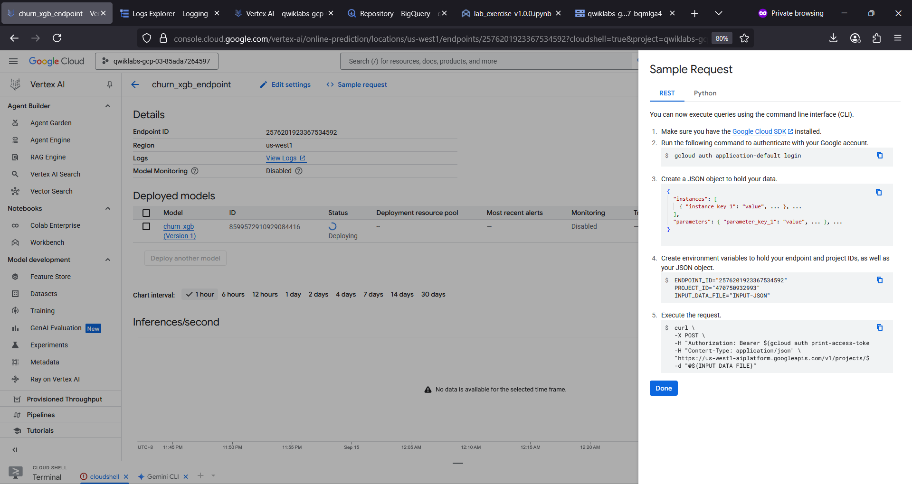

# churnxgb 📉🚀😀
churnxgb : Customer Churn Predictions # BQML # XGBoost Classifier

## Objective
- Explore & preprocess a Google Analytics 4 data sample in BigQuery for machine learning.
- Train BQML XGBoost classifier to predict user churn on a mobile gaming application.
- Tune BQML XGBoost classifier using BigQuery ML hyperparameter tuning features.
- Evaluate the performance of BQML XGBoost classifier.
- Explain XGBoost model with BQML Explainable AI global feature attributions.
- Generate batch predictions with your BQML XGBoost model.
- Export BQML XGBoost model to Google Cloud Storage bucket.
- Upload & deploy a BQML XGBoost model to Vertex AI Prediction Endpoint for online predictions.

## Deploy BigQuery ML Customer Churn Classifier to Vertex AI for Online Predictions 

